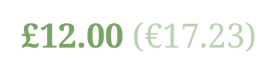

# Locurro [](https://travis-ci.org/umpirsky/locurro)

:euro: Local currency converter.

## Use Case

Imagine you have an online store, and you are selling goods in many different countries.
Some of your buyers might live in countrie that uses currency other then one you use in your store.
It would be cool to give them estimation of product costs in their domestic currency.

Here is one example of showing approximate price under the brackets:




## Basic Usage

### Convert based on currency

```php
$converter->convert(
    new Money\Money(100, new Money\Currency('EUR')),
    new Money\Currency('RSD')
);

```

Full example in [examples/currency.php](https://github.com/umpirsky/locurro/blob/master/examples/currency.php).

### Convert based on locale

```php
$converter->convert(
    new Money\Money(100, new Money\Currency('EUR')),
    'sr-Cyrl-RS'
);

```

Full example in [examples/locale.php](https://github.com/umpirsky/locurro/blob/master/examples/locale.php).

### Convert based on country

```php
$converter->convert(
    new Money\Money(100, new Money\Currency('EUR')),
    'RS'
);

```

Full example in [examples/country.php](https://github.com/umpirsky/locurro/blob/master/examples/country.php).

### Convert based on IP address

```php
$converter->convert(
    new Money\Money(100, new Money\Currency('EUR')),
    '109.92.115.78'
);

```

Full example in [examples/ip.php](https://github.com/umpirsky/locurro/blob/master/examples/ip.php).

## Advanced Usage

### Chaining providers

Locurro uses [Swap](http://florianv.github.io/swap/) library for exchange rates.

There are multiple exchange rate providers supported:

- [European Central Bank](http://www.ecb.europa.eu/home/html/index.en.html)
Supports only EUR as base currency.
- [Google Finance](http://www.google.com/finance)
Supports multiple currencies as base and quote currencies.
- [Open Exchange Rates](https://openexchangerates.org)
Supports only USD as base currency for the free version and multiple ones for the enterprise version.
- [Xignite](https://www.xignite.com)
You must have access to the `XigniteGlobalCurrencies` API.
Supports multiple currencies as base and quote currencies.
- [Yahoo Finance](https://finance.yahoo.com/)
Supports multiple currencies as base and quote currencies.
- [WebserviceX](http://www.webservicex.net/ws/default.aspx)
Supports multiple currencies as base and quote currencies.
- [National Bank of Romania](http://www.bnr.ro)
Supports only RON as base currency.
- `Array`
Retrieves rates from a PHP array.

You can chain them, see example in [examples/ip-chained.php](https://github.com/umpirsky/locurro/blob/master/examples/ip-chained.php).

### Caching

You can cache exchange rates using Doctrine cache or Illuminate cache.

Example is available in [examples/ip-cached.php](https://github.com/umpirsky/locurro/blob/master/examples/ip-cached.php).
